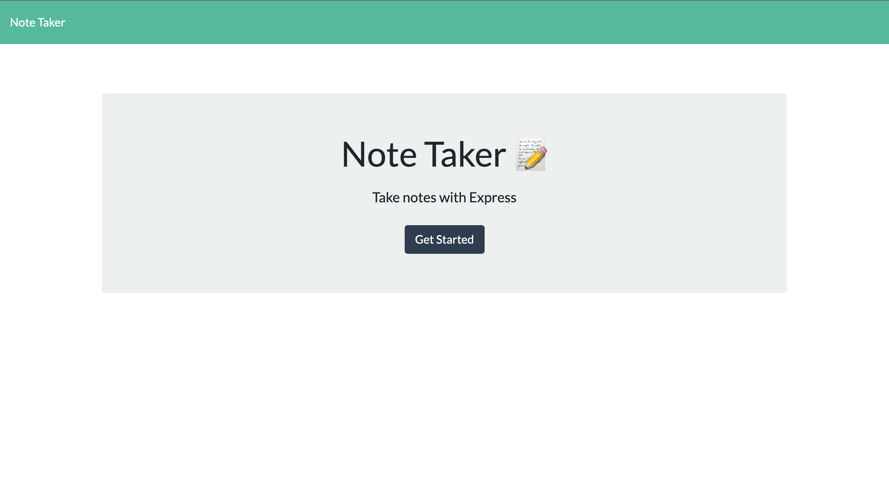

# Note Taker 

## 📝 Table of Contents
* [License Utilized](#license-utilized)
* [Project Details](#project-details)
* [Usage Information](#usage-information)
* [Installation Instructions](#installation-instructions)
* [Contribution Guidelines](#contribution-guidelines)
* [Testing Guidelines](#testing-guidelines)
* [Any Questions ?](#any-questions)

## 🔑 License Utilized
MIT 

## 🚀 Project Details
Utilizing Node.js and Express.js I developed the backend of the application that allows the user to add new notes and save them to a dashboard. [Deployed Heroku App](https://baroque-monsieur-13017.herokuapp.com/)

## 👩‍💻 Usage Information
This application is used to help organize a user's notes into one place. This application is deployed using Heroku.

## 💻 Installation Instructions
In order to run this application the user needs to install the npm package.

## 🤝 Contribution Guidelines
As of now there are no plans for other developers to contribute to this repository.

## 💡 Testing Guidelines
Developers can run the command “node index.js” in the command line to test this application. 

## 🙋‍♀️ Any Questions?

If you have any further questions please reach out.

Email: jeanette.k.ralph@gmail.com 

GitHub link: [Note Taker Repository](https://github.com/Jeanette-Ralph/Note-Taker)

GitHub username: [Jeanette-Ralph ](https://github.com/Jeanette-Ralph)

